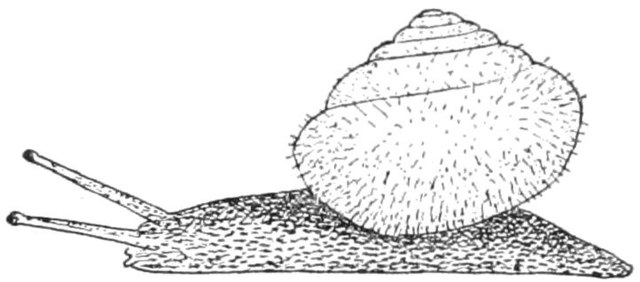

# Introduction



rw is a cli to port the function rec_wizard into python. As the name suggests this rec_wizard
helps the user record demos by making a queue for them to use.


Essentially the user will configuration their `$HOME/.config/rw-common/config.ini`, to have 
a queue of comma separated songs, `Song 1, Song 2, Song3`, and then the user will also
need to setup a dir to store their lyrics for these songs and a dir for their lilypond notes.

Currently these bare minimum requirements are necessary to access the urwid menus that are the
core of `rw`.

## How rw stores songs

After recording the songs using `sox` rw will store the songs in the dir specified in `recording_dir`
by creating a `recording/demos/sessions` dir tree, and then storing each new take of a song under
new dir with `<date>/<song> - Takes Directory`.

When you are finished recording you should press `q` and a menu will ask you if you want to 
link the take under your `<recording_dir>/demos`. For more info see the man pages in the repo. 


# Installation

after cloning the repo, cd into it and create a venv with `python -m venv myenv`.

Then run:
```
source ./myenv/bin/activate
```
and then
```
pip install --editable ./
```

after you can link this to your `$PATH` with:

```
ln -sf /home/$USER/path/to/rw-common/myenv/bin/rw ~/.local/bin/rw

```

then you can run the program with:

```
rw start
```


enjoy!

## Known Bugs

In Kubuntu, you will need to install support for pyaudio:


To successfully install PyAudio, you need to ensure that the `portaudio`
library and development headers are installed on your system. You can follow
these steps to resolve the issue:

1. Install PortAudio:
   
   On Ubuntu/Kubuntu, you can install the `portaudio` library and development headers using the package manager. Run the following command to install `portaudio19-dev`, which includes the necessary development headers and libraries:
   
   ```
   sudo apt update
   sudo apt install portaudio19-dev
   ```
