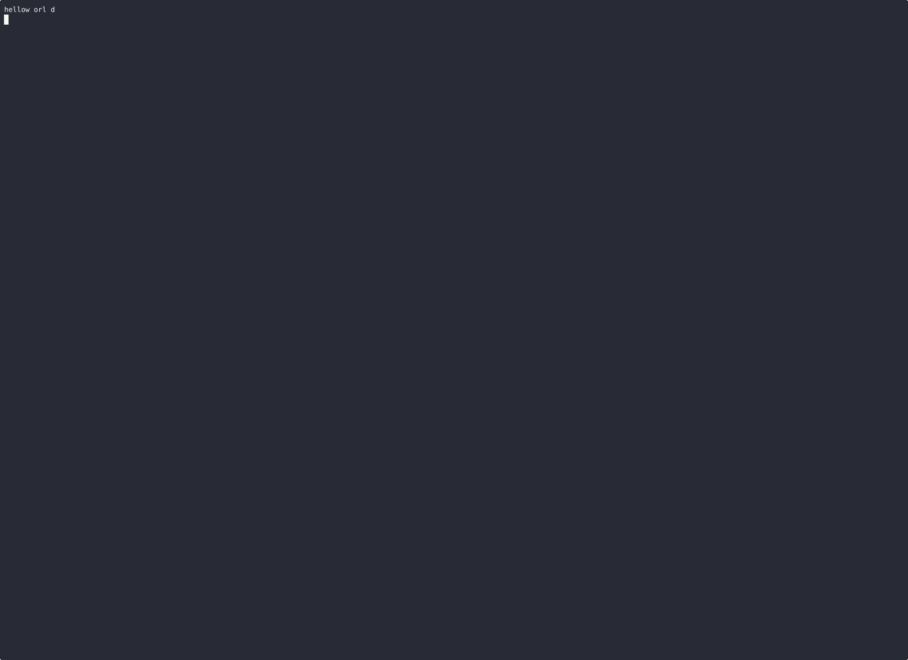

# Introduction


rw is a cli to port the function rec_wizard into python. As the name suggests this rec_wizard
helps the user record demos by making a queue for them to use.




Essentially the user will configuration their `$HOME/.config/rw-common/config.ini`, to have 
a queue of comma separated songs, `Song 1, Song 2, Song3`, and then the user will also
need to setup a dir to store their lyrics for these songs and a dir for their lilypond notes.

Currently these bare minimum requirements are necessary to access the urwid menus that are the
core of `rw`.

## How rw stores songs

After recording the songs using `sox` rw will store the songs in the dir specified in `recording_dir`
by creating a `recording/demos/sessions` dir tree, and then storing each new take of a song under
new dir with `<date>/<song> - Takes Directory`.

### Why rw stores them like this

At base, rw is a program for refining the perform of specific songs, by giving the user a predefined
setlist, and instilling a routine around going over them.

To serve this end, the recordings are stored in the `<date>/<song> - Takes Directory` while the
user is asked to update links in the parent dirs that serve as more refined versions of those songs.

In this way a songwriter could experiment with new sections to a piece while still keeping recordings
for reference about how the song sounded before. 


#### Storage Diagram
```
.
├── demos
│   ├── Song 1.ogg -> /home/kallynakill/RecFiles/recordings/demos/sessions/2025-04-19/Song 1 - Takes Directory/Song 1 41c572cb55.ogg
│   ├── Song 2.ogg -> /home/kallynakill/RecFiles/recordings/demos/sessions/2025-02-23/Song 2 - Takes Directory/Song 2 e1601989bc.ogg
│   └── sessions
│       ├── 2024-08-23
│       │   ├── Song 3.ogg -> /home/kallynakill/RecFiles/recordings/demos/sessions/2024-08-23/Song 3 - Takes Directory/Song 3 100947a8b2.ogg
│       │   └── Song 3 - Takes Directory
│       │       └── Song 3 100947a8b2.ogg
│       ├── 2025-02-07
│       │   ├── Song 4.ogg -> /home/kallynakill/RecFiles/recordings/demos/sessions/2025-02-07/Song 4 - Takes Directory/Song 4 f3c7255b28.ogg
│       │   └── Song 4 - Takes Directory
│       │       └── Song 4 f3c7255b28.ogg


```

Above you can see an example of how the song recordings are stored. Links to
the recordings stored in the `<date>/<song> - Takes Directory`, can be linked
to `<date>` dir, the `<session>` dir (not shown), or the `<demos>` dir.

This allows the user to overwrite the links in the `<demo>` once they have found a preferable rendition, or variant, while
also allowing the user to store less polished versions in the `<session>` or `<date>` dirs.


When you are finished recording you should press `q` and a menu will ask you if you want to 
link the take under your `<recording_dir>/demos`. For more info see the man pages in the repo. 

## Using setlists

The user can pre-define setlists in the `config.ini` file to stream-line the recording process.
This is done by defining the setlist as the key to a key value pair within the section `setlist`
of the config file.

As an example, your `config.ini` could contain:

```
[setlist]
static = Song 1, Song 2, Song 3
setlistB = Song 4, Song 5, Song 6
```

In this way starting the program with `rw start -s setlistB` would launch the menu from _Song 4_.

### Separating setlist recording dirs

Initially the static setlist is set to record using the config section `dir` option `recording_dir`, however if
you have defined your own setlists you can create a section in the config file to set an alternate recording
dir for that setlist. For instance with our above example we add, assuming that we are `user` on a linux system:

```
[setlistB]
recording_dir = /home/user/setlistB/
```

This would put all our recordings of that setlist in that dir.
# Installation

after cloning the repo, cd into it and create a venv with `python -m venv myenv`.

Then run:
```
source ./myenv/bin/activate
```
and then
```
pip install --editable ./
```

after you can link this to your `$PATH` with:

```
ln -sf /home/$USER/path/to/rw-common/myenv/bin/rw ~/.local/bin/rw

```

then you can run the program with:

```
rw start
```


enjoy!

## Known Bugs

In Kubuntu, you will need to install support for pyaudio:


To successfully install PyAudio, you need to ensure that the `portaudio`
library and development headers are installed on your system. You can follow
these steps to resolve the issue:

1. Install PortAudio:
   
   On Ubuntu/Kubuntu, you can install the `portaudio` library and development headers using the package manager. Run the following command to install `portaudio19-dev`, which includes the necessary development headers and libraries:
   
   ```
   sudo apt update
   sudo apt install portaudio19-dev
   ```
